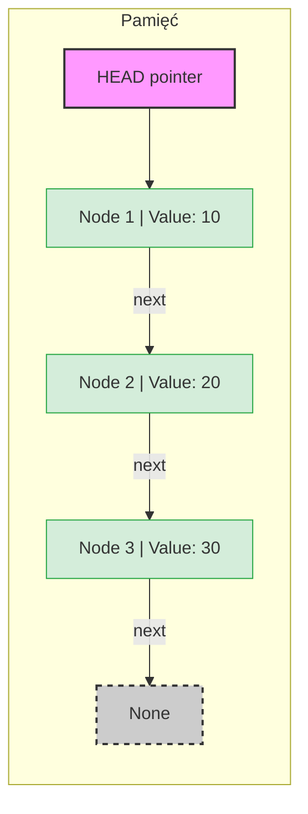

# Struktury Liniowe: Więcej niż tablice

- W innych językach rozróżniamy tablice (`int[]`) od list (`List<int>`).
- W Pythonie głównym bohaterem jest **Lista**, która potrafi udawać prawie wszystko.

## 1. Lista (`list`)
- To dynamiczna sekwencja elementów.
- W przeciwieństwie do tablic w C#, lista w Pythonie może przechowywać różne typy danych

### Podstawy pracy
```python
# Deklaracja
liczby = [1, 5, 10, 15]

# Dostęp (indeksowanie od 0)
print(liczby[0])  # -> 1
print(liczby[-1]) # -> 15 (Ostatni element - super przydatne!)

# Modyfikacja
liczby.append(20) # Dodanie na koniec (szybkie: O(1))
liczby[1] = 99    # Zmiana wartości

# Liczba elementów
ilosc_elementow = len(liczby) # 4


# iterowanie po liście
for number in liczby:
    print(number)

# iterowanie po elementach i indeksach
# enumerate zwraca pary: (indeks, element)
for index, number in enumerate(liczby):
    print(f"Indeks: {index}, Liczba: {number}")


# iterowanie po elementach i indeksach przy zmianie pierwszego indeksu
# indeksowanie od 10
for numer, liczba in enumerate(liczby, start=10):
    print(f"Pozycja: {numer}, Wartość: {liczba}")


```

### *Slicing* (wycinanie)
- Pozwala pobierać fragmenty list bez pętli `for`.
- Składnia: `lista[start:stop:krok]`

```python
t = [0, 1, 2, 3, 4, 5]

print(t[1:4])   # -> [1, 2, 3] (od indeksu 1 do 3 włącznie)
print(t[:3])    # -> [0, 1, 2] (pierwsze trzy)
print(t[::-1])  # -> [5, 4, 3, 2, 1, 0] (odwrócenie listy!)

```


### *List comprehensions*

Klasyczne podejście:
```python
liczby = [1, 2, 3, 4, 5]
kwadraty = []
for x in liczby:
    if x % 2 == 0:
        kwadraty.append(x**2)

print(kwadraty) # [4, 16]

```

Wersja pythonowa
```python
liczby = [1, 2, 3, 4, 5]
#          [co_zrobic   dla_kogo  z_czego     warunek      ]
kwadraty = [x**2        for x     in liczby   if x % 2 == 0]
print(kwadraty)
```
(te spacje między wyrażeniami nie są istotne)

### Pułapka referencji
W Pythonie przypisanie listy do nowej zmiennej nie kopiuje jej,
a jedynie tworzy nową etykietę (referencję) do tego samego obiektu w pamięci.

```python
a = [1, 2, 3]
b = a          # b wskazuje na to samo co a!
b[0] = 999

print(a)       # -> [999, 2, 3]  <-- Zmieniło się też 'a'!

```
Jak to naprawić (Kopiowanie): Jeśli potrzebujesz niezależnej kopii, musisz użyć jednej z metod:
- `b = a[:]` (najczęstszy sposób - slicing całej listy)
- `b = a.copy()`
- `b = list(a)`

### Operacje "In-Place" vs Zwracanie Wyniku 🔄
Metody list w Pythonie często modyfikują listę w miejscu i zwracają None.
- `lista.sort()`  sortuje oryginalną listę, nic nie zwraca (wynik to None).
- `sorted(lista)` tworzy nową, posortowaną listę, oryginał zostaje bez zmian.

---
## 2. Krotka (tuple)
- Krotka to niezmienna (immutable) lista.
- Raz stworzona, nie może być edytowana. Używamy jej, gdy dane mają być stałe (np. współrzędne punktu, wymiary planszy).

```python
# Krotka używa nawiasów okrągłych
punkt = (10, 20)
x, y = punkt  # Rozpakowywanie (destructuring) - znacie to z Kotlina/JS

# punkt[0] = 5  <- BŁĄD! TypeError: 'tuple' object does not support item assignment

```
---
## 3. Napisy – niezmienna lista znaków
- W Pythonie napis to niezmienna sekwencja znaków.
- Traktujemy go niemal identycznie jak krotkę (`tuple`) zawierającą znaki.

:::tip `lista[::-1]`
- To jest idiom Pythona służący do odwracania kolejności (reverse) elementów sekwencji.
- Działa to nie tylko na napisach (str), ale też na listach (list) i krotkach (tuple).
- `[start : stop : step ]`
- `[::-1]` - zacznij od początku aż do końca, no i zacznij od końca ;)

:::

```python
s = "Matura2025"

print(s[0])      # 'M'
print(s[-1])     # '5'
print(s[0:6])    # 'Matura'
print(len(s))    # 10

# string jest niemutowalny
s = "Kot"
# s[0] = "P"  <-- BŁĄD! TypeError: 'str' object does not support item assignment

print(s)
# zmiana wewnątrz string to stworzenie nowego
s = "P" + s[1:] # Tworzy nowy napis "Pot"
print(s)


# sprawdzenie, czy tekst jest palindromem
tekst = "kajak"
czy_palindrom = tekst == tekst[::-1] # True
print(f"tekst dla słowa {tekst}: {czy_palindrom}")

tekst = "pies"
czy_palindrom = tekst == tekst[::-1] # True
print(f"tekst dla słowa {tekst}: {czy_palindrom}")


```

### 4. Lista Wiązana (Linked List) – łańcuch wskaźników
W Pythonie standardowa `list` to tak naprawdę **tablica dynamiczna** (ciągły blok pamięci).

Lista wiązana to zupełnie inna bestia.

Python nie ma jej wbudowanej (w przeciwieństwie do `LinkedList<T>` w C#),
więc na maturze często musisz zaimplementować ją sam, używając klas.


### Czym to się różni? (Tablica vs Lista Wiązana)

Wyobraź sobie dwa sposoby organizacji uczniów w klasie:

1.  **Tablica (Python `list`):** Uczniowie siedzą w ławkach w jednym rzędzie, ramię w ramię.
* *Zaleta:* Chcesz ucznia nr 5? Od razu wiesz, gdzie siedzi (matematyka: adres początku + 5).
* *Wada:* Chcesz wcisnąć kogoś na początek? Wszyscy muszą się przesiąść (przesuwanie pamięci).

2.  **Lista Wiązana:** Uczniowie siedzą losowo po całej szkole.
Każdy uczeń trzyma karteczkę z numerem sali, gdzie siedzi **następny** uczeń.
* *Zaleta:* Chcesz dodać kogoś w środku? Wystarczy zmienić treść jednej karteczki.
* *Wada:* Chcesz ucznia nr 5? Musisz biec od pierwszego do drugiego, do trzeciego... aż dojdziesz do piątego.


### Porównanie złożoności ($N$ - liczba elementów)

| Operacja | Python `list` (Tablica) | Lista Wiązana (Linked List) |
| :--- | :--- | :--- |
| Dostęp do elementu `[i]` | ⚡ **$O(1)$** | 🐢 **$O(n)$** |
| Dodanie na początek | 🐢 **$O(n)$** (przesuwanie) | ⚡ **$O(1)$** (przepięcie wskaźnika) |
| Dodanie na koniec | ⚡ **$O(1)$** | 🐢 **$O(n)$** (trzeba dojść na koniec)* |
| Zużycie pamięci | Małe (tylko dane) | Większe (dane + wskaźniki) |

*\*Chyba że trzymamy dodatkowy wskaźnik na ogon (tail).*

### Implementacja w Pythonie
```
class Node:
    // __init__ to konstruktor
    // self - pierwszy argument metody, przechowuje referencję do tworzonego obiektu
    def __init__(self, value):
        self.value = value
        self.next = None  # Odpowiednik null w C#/Kotlin


class LinkedList:
    def __init__(self):
        self.head = None  # Pusta lista

    # Dodawanie na początek (Push) - O(1)
    def prepend(self, value):
        new_node = Node(value)
        new_node.next = self.head  # Nowy wskazuje na starą głowę
        self.head = new_node  # Nowy staje się głową

    # Wyświetlanie (Trawersacja) - O(n)
    def print_list(self):
        current = self.head
        while current is not None:
            print(f"[{current.value}]", end=" -> ")
            current = current.next
        print("None")

    # Dodawanie na koniec (Append) - O(n)
    def append(self, value):
        new_node = Node(value)

        # Przypadek 1: Lista jest pusta
        if self.head is None:
            self.head = new_node
            return

        # Przypadek 2: Idziemy do ostatniego elementu
        current = self.head
        while current.next is not None:
            current = current.next

        current.next = new_node


# UŻYCIE
# Tworzymy listę
lista = LinkedList()

lista.append(10)
lista.append(20)
lista.prepend(5)  # Wskakuje na początek!

lista.print_list()
# Wynik: [5] -> [10] -> [20] -> None

```
### Wizualizacja Listy Wiązanej

Aby zrozumieć, dlaczego dostęp do elementu w liście wiązanej jest wolny (`O(n)`),
a dodawanie na początek szybkie (`O(1)`), musimy zobaczyć, jak jest ona ułożona w pamięci.

**Model Logiczny (Łańcuch)**

Logicznie, lista wiązana to ciąg "pudełek" (Węzłów/Nodes). Każde pudełko ma dwie przegródki:
1.  **Wartość:** Dane, które przechowujemy (np. liczba 10).
2.  **Next (Wskaźnik):** Strzałka pokazująca, gdzie szukać następnego pudełka.

Ostatnie pudełko wskazuje na `None` (koniec). Mamy dostęp tylko do pierwszego pudełka (`HEAD`).



Wniosek:
- Aby dostać się do wartości "30", musisz przejść przez "10" i "20".\
- Nie możesz "przeskoczyć" bezpośrednio do trzeciego elementu, bo nie znasz jego adresu.

```mermaid
graph LR
    HEAD[HEAD] --> NEW_NODE

    subgraph Operacja O(1) - Przepięcie
        %% ZMIANA: Cudzysłowy tutaj
        NEW_NODE["NOWY Node: 5"] -->|1. next wskazuje na starego| N1["Stary Node: 10"]
    end

    N1 --> N2["Node: 20"]

    style NEW_NODE fill:#ffedcc,stroke:#ffc107,stroke-width:2px
```


---
## 5. Stos

:::note Stos (*Stack*)
- Wyobraź sobie stos talerzy w kuchni. Kiedy układasz talerze jeden na drugim:
  - ten, który położysz na samym szczycie jako ostatni,
  - będzie pierwszym, który zdejmiesz.
- Zasada działania: LIFO (*Last In, First Out*) – Ostatnie Weszło, Pierwsze Wyszło.


Kiedy jest wykorzystywany?
- Funkcja "Cofnij" (Undo/Ctrl+Z): W edytorach tekstu ostatnia wykonana akcja jest zdejmowana ze stosu jako pierwsza, gdy chcesz ją cofnąć.
- Stos wywołań (Call Stack): Gdy program wywołuje funkcję wewnątrz innej funkcji, komputer musi pamiętać, gdzie wrócić po zakończeniu tej zagnieżdżonej funkcji.
- Sprawdzanie poprawności nawiasów: W kodzie lub matematyce, aby upewnić się, że każdy nawias otwierający ma pasujący nawias zamykający.


:::

```python
stos = ["A", "B"]
stos.append("C")
print(stos)         # ['A', 'B', 'C']
print(stos.pop())   # -> "C"
print(stos)         # ['A', 'B']
```


## 6. Kolejka

:::note Kolejka (*Queue*)‍♀️
- Pomyśl o kolejce do kasy w sklepie. Osoba, która ustawi się w kolejce jako pierwsza, zostanie obsłużona jako pierwsza. Nowe osoby dochodzą na koniec kolejki.
- Zasada działania: FIFO (*First In, First Out*) – Pierwsze Weszło, Pierwsze Wyszło.
- Kiedy jest wykorzystywana?
  - Buforowanie wydruku: Dokumenty wysłane do drukarki czekają w kolejce. Ten wysłany pierwszy, drukuje się pierwszy.
  - Obsługa żądań na serwerze: Jeśli wiele osób próbuje wejść na stronę w tym samym momencie, serwer obsługuje ich żądania po kolei.
  - Algorytm BFS: Przeszukiwanie grafu wszerz (np. znajdowanie najkrótszej drogi w labiryncie).


```python
from collections import deque

# Tworzymy pustą kolejkę
kolejka = deque()

# 1. Enqueue (Dodawanie na koniec)
kolejka.append("Klient 1")
kolejka.append("Klient 2")
kolejka.append("Klient 3")

print(f"Kolejka: {kolejka}")

# 2. Dequeue (Pobieranie z początku)
# popleft() jest kluczowe! Zwykłe pop() usuwa z końca (jak stos).
obsluzony = kolejka.popleft()

print(f"Obsłużono: {obsluzony}")
print(f"Zostało: {kolejka}")

# 3. Sprawdzanie czy pusta
if not kolejka:
    print("Kolejka jest pusta!")
else:
    print(f"Liczba osób: {len(kolejka)}")

```


:::danger Nigdy nie używaj zwykłej listy jako kolejki FIFO (First-In-First-Out)!
Dlaczego?
- Usunięcie pierwszego elementu z listy (`lista.pop(0)`) zmusza komputer do przesunięcia wszystkich pozostałych elementów w pamięci.
- Dla dużej liczby danych jest to bardzo wolne (`O(n)`).

:::

**Szybka i nieefektywna implementacja kolejki**
```python
kolejka_listowa = [-2,-1]

# Enqueue
kolejka_listowa.append(1)
kolejka_listowa.append(2)

# Dequeue
# pop(0) usuwa element o indeksie 0
element = kolejka_listowa.pop(0)
print(element)
print(kolejka_listowa)

```


